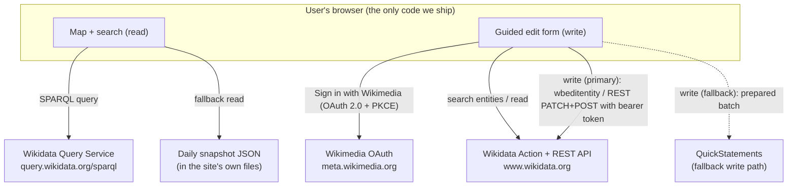

# Directory of Socio‑Legal Associations — Design Specification

**Status:** Draft for discussion
**Date:** 2026‑09‑01
**Audience:** Part 1 is written for a non‑technical reader (a scholar with no computer‑science background). Part 2 is the precise technical specification.

---

## Part 1 — Non‑technical overview

### 1.1 What we are building

A **public, interactive world map** of socio‑legal scholarly associations. A visitor opens a
web page, sees a zoomable map, clicks on a country, and reads a short card about that
country's association(s): the association's name, its geographic scope
(national / regional / topical / international), its website, an institutional e‑mail
address, and its current contact person — normally the president — together with the
university that person is based at.

Alongside the public map there is an **edit mode**. A logged‑in user can add a new
association, correct an existing one, or record that an association has elected a new
president, through a guided form that is much simpler than editing the underlying
database by hand.

### 1.2 The key design decision: we do not run our own database

All the information lives in **Wikidata** — the free, open knowledge database run by the
Wikimedia Foundation (the same charitable organisation behind Wikipedia). This choice
has three consequences that shape everything else:

- **The data is public and reusable by default.** Anyone — including other projects,
  researchers, or journalists — can query it, and it does not disappear if our project
  ends.
- **The data can be maintained by many people, from anywhere.** There is no central
  gatekeeper who must enter every change. An association's own officers can keep their
  entry current.
- **We inherit Wikidata's rules and safety net.** Every change is permanently recorded
  with the name of the person who made it, and any change can be reviewed or undone by
  the wider Wikidata community. In return, the information has to meet Wikidata's
  modest "notability" bar (see 1.7).

Our web application is therefore quite small: it is a **viewer and a friendly editing
form on top of Wikidata**. It stores nothing of its own.

### 1.3 The three connected records

For each association there are three linked records in Wikidata:

```
        [ Association ]
              |
        chairperson / president
              |
              v
         [ Contact person ]
              |
        employed by / affiliated with
              |
              v
         [ University ]  (already exists in Wikidata)
```

- The **Association** record holds the association's own facts: name, scope, country,
  website, institutional e‑mail, founding year, and a pointer to its current president.
- The **Contact person** record is the president: their name, that they are a scholar,
  a link to their academic homepage, ideally their ORCID identifier (a standard
  researcher ID), and a pointer to their university.
- The **University** record almost always already exists in Wikidata. We only ever
  *link to it*; we never create it.

**Where the association sits on the map** is worked out from this chain: we take the
president, find their university, and use the university's coordinates. If a piece is
missing we fall back step by step (see 2.4) — for example to the university's city, or
to the centre of the association's country.

### 1.4 How viewing works (no login)

1. The visitor opens the web page. It is a set of ordinary files served by a normal web
   server — there is no application server behind it.
2. The page asks Wikidata's public query service a single question: *"list every
   socio‑legal association with its president, university, coordinates and contact
   details."*
3. The page draws the answer on the map. A locally stored copy and a daily backup file
   mean the map still works if Wikidata is briefly slow or unavailable.

### 1.5 How publishing and editing works

Editing writes **directly to Wikidata, under the editor's own Wikimedia account**.
There is no separate approval queue in our application; the safety net is Wikidata's
permanent history and the ability of anyone to correct a mistake (this matches the
decision that "anyone with a Wikimedia account" may edit).

**Signing in.** The editor clicks *"Sign in with Wikimedia."* The browser goes to
Wikimedia's own login page, the editor logs in there, and Wikimedia sends the browser
back to our page with a temporary permission slip ("token"). **No password is ever
seen or stored by our site.** The token is held only for the browser session and is
discarded when the tab is closed or the editor signs out.

**Workflow A — adding a brand‑new association**

1. The editor types the association's name. As they type, the form searches Wikidata
   and shows any matches. A *"None of these — create new"* button appears; the
   create form is shown **only** after the editor clicks it. This is the main
   safeguard against creating duplicates.
2. The editor fills in scope, country, website and institutional e‑mail, and adds at
   least one reference (a web page that confirms the facts).
3. The editor types the president's name. Same search‑first behaviour. If the person
   is not found, a short form creates their record: name, "is a researcher", academic
   homepage, ORCID if known, and their university.
4. The editor picks the **university** from a search box. Universities are never
   created here; if one is genuinely missing, the form stops and asks for it to be
   added to Wikidata first.
5. The editor reviews a plain‑language summary ("Create association X; create person
   Y; record Y as president of X; record Y as affiliated with University Z") and
   confirms.
6. The form makes the changes and shows links to the resulting Wikidata pages.

**Workflow B — recording a new president after an election**

1. The editor opens the association from the map and clicks *Edit*.
2. They search for and select the new president (creating the person record only if
   necessary, as above).
3. The form records the new president, and marks the previous president's term as
   ended (with a date), so the history is preserved.

**Workflow C — fixing a detail** (e.g. a changed e‑mail address or website): open the
association, edit the field, confirm. One change, one confirmation.

### 1.6 Maintenance burden

The project deliberately has a **small and mostly non‑technical** maintenance load.

**Editorial / community work (ongoing, light):**

| Task | Effort | Who |
| --- | --- | --- |
| Encouraging associations to add/refresh their entry | Ad hoc | Project lead / steering group |
| Watching the entries for bad edits (Wikidata gives a ready‑made watch list / dashboard) | ~15 min per week | Any trained contributor |
| Answering occasional Wikidata community questions or notability challenges | Rare, unpredictable | Someone comfortable on Wikidata |
| Agreeing modelling conventions with the relevant Wikidata subject group | Mostly one‑off | Project lead + a Wikidata‑literate helper |
| Nudging associations to record new presidents after elections | Ad hoc | Project lead |

**Technical work (occasional, small):**

| Task | Effort | Who |
| --- | --- | --- |
| One‑time registration of the app with Wikimedia's login system | ~15 minutes, once | Web developer (or a careful non‑developer with instructions) |
| Keeping the optional daily backup job running | ~5 min per month to glance at | Web developer |
| Updating the map/library versions; adjusting if Wikidata changes an interface | ~1–2 developer‑days per year, not a standing role | Web developer |
| Re‑deploying after a change | "Upload the new ZIP" / one command | Web developer or site maintainer |

**What is explicitly *not* a burden:**

- No server to keep running, patch, or scale — the site is static files.
- No database to host or back up — Wikidata is the database, maintained and backed up
  by the Wikimedia Foundation; every record's full history is kept permanently.
- No user accounts, passwords or personal‑data store of our own — identity is handled
  by Wikimedia.
- Hosting cost is effectively zero (static hosting or GitHub Pages / Cloudflare Pages).

**Privacy note.** The contact‑person information is already public data on Wikidata.
Our site stores nothing about anyone. We will record only professional facts (name,
role, employer, academic website, ORCID) and deliberately avoid private details such
as date of birth or home address.

### 1.7 What could go wrong, and how it is handled

| Risk | Handling |
| --- | --- |
| Browser security rules block our page from writing to Wikidata directly | A fallback path hands the prepared changes to *QuickStatements*, an established Wikimedia community tool, which performs the write. Still nothing for us to host. A one‑day test up front tells us which path we are on. |
| A new person or association is challenged as "not notable" on Wikidata | The form requires a reference on every new record and encourages ORCID and links to the university page. Presidents of scholarly societies with an institutional page normally clear the bar. |
| Wikidata's query service is briefly unavailable | The page keeps a local copy and there is a daily backup file, so the map still loads. |
| Two records get created for the same association or person | Search‑first forms, an explicit "create new" step, ORCID matching, and a final confirmation. |
| People edit the Wikidata records by hand in inconsistent ways | The map query uses step‑by‑step fallbacks and the app tolerates missing fields. |

---

## Part 2 — Technical specification

### 2.1 Architecture



**Components we build:** a static single‑page application (HTML/CSS/JS). No backend,
no database, no server‑side rendering.

**External services (all Wikimedia, all CORS‑accessible from the browser):**

- **Wikidata Query Service** (`https://query.wikidata.org/sparql`) — SPARQL reads.
- **Wikidata Action API** (`https://www.wikidata.org/w/api.php`) — `wbsearchentities`,
  `wbgetentities`, `wbeditentity`.
- **Wikibase REST API** (`https://www.wikidata.org/w/rest.php/wikibase/v1/…`) —
  preferred for structured create/patch where available.
- **Wikimedia OAuth 2.0** (`https://meta.wikimedia.org/w/rest.php/oauth2/…`) — login
  and token exchange.
- **QuickStatements** (`https://quickstatements.toolforge.org`) — fallback write path
  only.

### 2.2 Hosting and delivery

- **Deliverable:** a ZIP of static files (or a `git push` to a Pages host). The final
  artefact is `index.html`, `callback.html`, bundled JS/CSS, `config.json`, and
  `data/snapshot.json`.
- **Requirements of the host:** serve the files over **HTTPS** at a **stable URL**.
  Nothing else (no Node, no PHP, no database).
- **Recommended hosts:** the maintainer's existing web server, GitHub Pages,
  Cloudflare Pages, or Netlify. GitHub Pages is *not* required and plays no special
  role in OAuth.
- **`config.json`** holds non‑secret settings: the OAuth **client ID** (public by
  design), the redirect URI, the target class/field QIDs, and label languages.

### 2.3 Data model in Wikidata

Property/QID numbers marked *(confirm)* are provisional and to be fixed with the
relevant Wikidata WikiProject before bulk editing.

**Association** — a Wikibase item.

| Statement | Property | Value / notes |
| --- | --- | --- |
| instance of | P31 | *learned society* Q955824 *(confirm)* or *voluntary association* Q48204; final class TBD with WikiProject |
| field of work | P101 | *sociology of law / socio‑legal studies* Q2734663 *(confirm)* — the marker that identifies an item as in scope |
| country | P17 | for national associations |
| operating area | P2541 *(confirm)* / applies to jurisdiction P1001 | for regional / international scope |
| official website | P856 | |
| e‑mail address | P968 | institutional e‑mail |
| inception | P571 | founding year (optional) |
| chairperson | P488 | → the Contact‑person item; qualifiers **start time P580**, **end time P582** so past presidents are retained |
| official name / short name | P1448 / P1813 | optional |

**Contact person** — a Wikibase item, `instance of` **human (Q5)**.

| Statement | Property | Value / notes |
| --- | --- | --- |
| occupation | P106 | *sociologist* / *legal scholar* / *researcher* |
| employer | P108 | → the University item (primary link for the triangle) |
| affiliation | P1416 | → the University item (used when employer is not appropriate/known) |
| official website | P856 | academic homepage — supports notability |
| ORCID iD | P496 | strongly recommended: identity + de‑duplication + notability |
| position held | P39 | *president* (optional), qualifier "of" the association |

**University** — existing item. Read‑only for this project. We rely on its
**coordinate location (P625)**, or **headquarters location (P159)** → city → P625.

**The relationship**, realised:

```
Association  --P488 chairperson-->  Contact person
Contact person  --P108 employer / P1416 affiliation-->  University
University  --P625 (or P159 -> city -> P625)-->  map coordinates
```

### 2.4 Read path

**Primary query.** On load, the app issues one SPARQL query to WDQS for all in‑scope
associations. Sketch:

```sparql
SELECT ?assoc ?assocLabel ?website ?email ?countryLabel
       ?president ?presidentLabel ?uni ?uniLabel ?coord WHERE {
  ?assoc wdt:P31/wdt:P279* wd:Q955824 .          # in-scope class (confirm)
  ?assoc wdt:P101 wd:Q2734663 .                  # field of work: sociology of law (confirm)
  OPTIONAL { ?assoc wdt:P856 ?website. }
  OPTIONAL { ?assoc wdt:P968 ?email. }
  OPTIONAL { ?assoc wdt:P17 ?country. }
  OPTIONAL {
    ?assoc p:P488 ?st . ?st ps:P488 ?president .
    FILTER NOT EXISTS { ?st pq:P582 ?ended. }    # current president only
    OPTIONAL { ?president wdt:P108 ?empUni. }
    OPTIONAL { ?president wdt:P1416 ?affUni. }
    BIND(COALESCE(?empUni, ?affUni) AS ?uni)
    OPTIONAL { ?uni wdt:P625 ?uniCoord. }
    OPTIONAL { ?uni wdt:P159/wdt:P625 ?uniCityCoord. }
    BIND(COALESCE(?uniCoord, ?uniCityCoord) AS ?coord)
  }
  SERVICE wikibase:label { bd:serviceParam wikibase:language "en,de,fr,es". }
}
```

**Location resolution precedence** (applied in JS over the query result, so the map
always has a point to draw):

1. President's employer (P108) → P625
2. President's affiliation (P1416) → P625
3. President's university → headquarters city (P159) → P625
4. Association headquarters (P159) → P625
5. Association country (P17) → country centroid (static lookup table shipped with app)

**Caching and resilience.**

- Result cached in `localStorage` with a timestamp; re‑fetched when older than a
  configurable TTL (e.g. 24 h) or on manual refresh.
- `data/snapshot.json` — a committed copy of the query result, refreshed by an
  optional scheduled job (GitHub Action) that commits the file. Used when WDQS is
  unreachable or slow. The dataset is small (order 10²–10³ rows), so query cost and
  file size are negligible.

**Type‑ahead** in the map search uses `wbsearchentities` (`origin=*`, anonymous,
CORS‑enabled).

### 2.5 Write path

**OAuth 2.0, public client, PKCE.**

- Register once at Meta‑Wiki `Special:OAuthConsumerRegistration` as a
  **non‑confidential (public) client** — no client secret.
- Grants: *edit existing pages*; *create, edit, and move pages*.
- Redirect URI: the deployed site's `…/callback.html` (exact, HTTPS; a second
  consumer with an `http://localhost` redirect is registered for development).
- Flow: `authorize` (with `code_challenge`) → browser returns to `callback.html` with
  `code` → `POST …/oauth2/access_token` with `code_verifier` → access token (+ refresh
  token) held in `sessionStorage`, cleared on sign‑out / tab close.
- The token exchange and all edits are **browser → Wikimedia directly**; nothing is
  proxied through infrastructure we own.

**Edit operations** (kept minimal; each is one API call with an explanatory
`summary`, e.g. `socio-legal directory: link association and president`):

| Operation | Effect |
| --- | --- |
| Link existing items | add `P488` on association; add `P108`/`P1416` on person |
| Create person, then link | new item: labels, `P31=Q5`, `P106`, `P108`, `P856`, `P496`; then link |
| Create association, then link | new item: labels/description, `P31`, `P101`, `P17`/`P2541`, `P856`, `P968`, `P571`, `P488`; then link |
| Update association field | set/replace `P968` or `P856` |
| Change president | add new `P488` with `P580`; add `P582` to the previous `P488` statement |

- **Primary API:** Wikibase REST API (`POST /entities/items`,
  `PATCH /entities/items/{id}` / `…/statements`) with `Authorization: Bearer`.
  Fall back to Action API `wbeditentity` where the REST endpoint is not suitable.
- **References:** every new item and every substantive statement carries at least one
  reference (`P854` reference URL) — enforced by the form.

**Fallback write path (QuickStatements).** If the up‑front feasibility test (2.7)
shows that authenticated cross‑origin writes from our domain are not accepted, the
form instead serialises the same change set into QuickStatements v1 syntax and opens
QuickStatements with it (via URL parameter or clipboard). QuickStatements handles its
own OAuth and performs the writes. No component of ours is added.

**Post‑write:** show the Wikidata diff/entity URLs; invalidate the affected rows in
the `localStorage` cache so the map reflects the change on next view.

### 2.6 Deduplication flow

For **association** and **person** fields:

1. On input (debounced), call `wbsearchentities` in the UI languages; for the person,
   also accept a pasted ORCID and resolve it via `haswbstatement:P496=<orcid>`.
2. Render candidates with label, description, and a disambiguating fact (person:
   employer/affiliation; association: country/field).
3. The "create new" sub‑form is rendered **only** after an explicit
   *"None of these — create new"* click.
4. Before submitting a creation, run a final check: exact label match + normalised
   fuzzy match (case/diacritics/whitespace folded) against Wikidata; if any hit, show
   it and require the editor to either pick it or tick "I confirm this is a distinct
   entity".

For **university**: search‑and‑pick only; no creation path. If nothing matches, block
with guidance to add the institution to Wikidata first.

### 2.7 Risks, open questions, and up‑front spikes

| Item | Action before build |
| --- | --- |
| **CORS for authenticated writes** from an arbitrary static origin to `www.wikidata.org` (REST + Action API, bearer token) | **1‑day spike.** If it works: path A (direct). If not: path B (QuickStatements). Architecture supports both; this only decides the default. |
| In‑scope **class + field QIDs** and modelling of scope (national/regional/topical/international) | Consult the relevant Wikidata WikiProject; record the agreed pattern in `config.json` and this spec. |
| **Notability** posture for contact persons | Enforce references + encourage ORCID; prepare a short rationale note to link in edit summaries. |
| Refresh token lifetime / silent renewal behaviour for public clients | Confirm during the OAuth spike; acceptable degradation is "sign in again". |

### 2.8 Out of scope (YAGNI)

- Any server, database, or hosted API of our own.
- User accounts, roles, or an approval queue inside the app (Wikidata history is the
  control).
- Editing or creating **university** records.
- Bulk import tooling (initial seeding can be done with QuickStatements by hand).
- Offline editing, mobile app, multi‑language content authoring beyond labels.
- Analytics / tracking.

### 2.9 Maintenance (technical detail)

- **Deploy:** rebuild static bundle, replace files (ZIP upload or `git push`). No
  migrations, no downtime.
- **Snapshot job:** GitHub Action on a schedule runs the SPARQL query and commits
  `data/snapshot.json`. Independent of where the site is hosted. Failure is
  non‑critical (live query still serves users).
- **Dependencies:** map library (e.g. MapLibre GL or Leaflet) and a small SPARQL/OAuth
  helper; pin versions; review a few times per year.
- **OAuth consumer:** re‑touch only on domain change or grant change; some changes
  require Wikimedia re‑approval (days).
- **API drift:** the Wikibase REST API is still evolving; budget a small annual check.
  The Action API and SPARQL endpoint are stable.

---

## Appendix — visualisation sketch (indicative only)

- Full‑bleed zoomable world map; association markers cluster when zoomed out.
- Clicking a country highlights it and lists that country's associations in a side
  panel.
- Association card: name, scope, official website, institutional e‑mail, current
  president (name + link to homepage), university, and an **Edit** button.
- Search box: jump to a country or an association (client‑side filter over the cached
  dataset, plus `wbsearchentities` for direct look‑ups).
- Visual design is deliberately unspecified at this stage.
