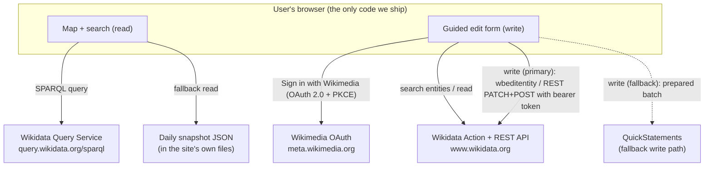

# Directory of Socio‑Legal Associations — Design Specification

**Status:** Draft for discussion

**Date:** 2026‑09‑01 · **Revised:** 2026‑09‑02 (reviewer comments: map by seat not president; notability/deletion risk; personal e‑mails; journals added to the model; reactive change‑monitoring — no scheduled task)

**Audience:** Part 1 is written for a non‑technical reader (a scholar with no computer‑science background). Part 2 is the precise technical specification.

**Companion document:** [`2026-09-02-ui-design.md`](2026-09-02-ui-design.md) covers the browser application — its structure, the no‑build decision, and a first visual sketch.

**Source data:** (deliberately kept out of the public repository)

---

## Part 1 — Non‑technical overview

### 1.1 What we are building

A **public, interactive world map** of socio‑legal scholarly associations. A visitor opens a
web page, sees a zoomable map, clicks on a country, and reads a short card about that
country's association(s): the association's name, its geographic scope
(national / regional / topical / international), its **seat**, its website, an
institutional e‑mail address, its current contact person — normally the president —
with the university that person is based at, and, where it has one, the journal the
association publishes. Each association is placed on the map by its **seat**, not by
where its current president happens to work (see §1.3).

Alongside the public map there is an **edit mode**. A logged‑in user can add a new
association, correct an existing one, or record that an association has elected a new
president, through a guided form that is much simpler than editing the underlying
database by hand.

### 1.2 The key design decision: we do not run our own database

All the information lives in **Wikidata** — the free, open knowledge database run by the
Wikimedia Foundation (the same charitable organisation behind Wikipedia). This choice
has three consequences that shape everything else:

- **The data is public and reusable by default.** Anyone — including other projects,
  researchers, or journalists — can query it, and it does not disappear if our project
  ends.
- **The data can be maintained by many people, from anywhere.** There is no central
  gatekeeper who must enter every change. An association's own officers can keep their
  entry current.
- **We inherit Wikidata's rules and safety net.** Every change is permanently recorded
  with the name of the person who made it, and any change can be reviewed or undone by
  the wider Wikidata community. In return, the information has to meet Wikidata's
  modest "notability" bar (see 1.7).

Our web application is therefore quite small: it is a **viewer and a friendly editing
form on top of Wikidata**. It stores nothing of its own.

### 1.3 The connected records

For each association there are up to four linked records in Wikidata:

```
                    [ Association ]
                    /      |       \
             seat /   chairperson   \ publishes
                 /         |         \
                v          v          v
        [ Seat / HQ ]  [ Contact ]  [ Journal ]   (journal only if the
         (a place or    person         |           association is the
          institution)     |           |           publisher — see §1.5)
                    employed by /  published by
                    affiliated with    |
                        |              |
                        v              v
                   [ University ]  [ Association ]
                   (already exists
                    in Wikidata)
```

- The **Association** record holds the association's own facts: name, scope, country,
  seat (if it has a fixed one), website, institutional e‑mail, founding year, a
  pointer to its current president, and — new in this revision — a pointer to its own
  journal where it has one.
- The **Contact person** record is the president: their name, that they are a scholar,
  a link to their academic homepage, ideally their ORCID identifier (a standard
  researcher ID), and a pointer to their university.
- The **University** record almost always already exists in Wikidata. We only ever
  *link to it*; we never create it.
- The **Journal** record is added **only for a journal the association itself
  publishes** (see §1.5). Many of these journal records already exist in Wikidata and
  are simply linked.

**Where the association sits on the map — primary rule: the association's seat, not
the president's university.** Reviewers pointed out that presidents rotate and often
sit far from the body's home base (the Asian Law and Society Association's president is
in Hong Kong while its office is at Waseda in Tokyo; the francophone AISLF has a
Canadian president but is run from France; the IVR's president is in South Korea).
Using the president's university would make the dot jump between continents at every
election. So:

1. **If the association has a fixed seat or secretariat**, the pin is placed there
   (e.g. the RCSL at Oñati, the Law and Society Association at Amherst).
2. **Otherwise** the pin is placed at the centre of the association's country or
   region.
3. **The current president's university is shown as an optional secondary layer** — a
   separate set of markers the viewer can switch on — never as the association's own
   position.

The workbook records, for every body, a **"seat type"** flag (*permanent
secretariat* / *circulates with chair* / *distributed*) that drives which of these
rules applies.

### 1.4 How viewing works (no login)

1. The visitor opens the web page. It is a set of ordinary files served by a normal web
   server — there is no application server behind it.
2. The page asks Wikidata's public query service a single question: *"list every
   socio‑legal association with its seat, country, president, president's university,
   own journal and contact details."*
3. The page draws the answer on the map. A locally stored copy and a daily backup file
   mean the map still works if Wikidata is briefly slow or unavailable.

### 1.5 How publishing and editing works

**The public application is read‑only by default.** It shows no "sign in" and no
"edit" control; a visitor never sees that editing exists. Editing is a **separate mode
that must be deliberately entered** — either automatically, because the person has
connected a Wikimedia account in this browser before, or via a special `?edit` link.
The full behaviour is in the companion UI spec
([`2026-09-02-ui-design.md`](2026-09-02-ui-design.md) §1.6, §2.3).

Once in edit mode, changes are written **directly to Wikidata, under the editor's own
Wikimedia account**. There is no separate approval queue in our application; the
safety net is Wikidata's permanent history and the ability of anyone to correct a
mistake (this matches the decision that "anyone with a Wikimedia account" may edit).

**Connecting an account.** The first time, the editor is sent to *Wikimedia's own
login page* and back, and our site receives a narrow, revocable permission slip
("token"). **No password is ever seen or stored by our site.** On later visits, if the
token was kept, edit mode resumes silently with no login step; otherwise the token
lives only for the browser session and is discarded when the tab closes or the editor
leaves edit mode.

**Workflow A — adding a brand‑new association**

1. The editor types the association's name. As they type, the form searches Wikidata
   and shows any matches. A *"None of these — create new"* button appears; the
   create form is shown **only** after the editor clicks it. This is the main
   safeguard against creating duplicates.
2. The editor fills in scope, country, website and **institutional** e‑mail (a role or
   office address only — never a person's private address, see §1.6), and adds at
   least one reference (a web page that confirms the facts).
3. The editor sets the **seat**: either "fixed seat / secretariat" (and picks the
   place or host institution, which becomes the map pin) or "no fixed seat / moves
   with the chair" (the pin then comes from the country).
4. If the body is a **section of a larger association** (for example the sociology‑of‑
   law section of a national sociological association), the editor links it to its
   parent so it is recorded as a part of that parent, not as a free‑standing body.
5. The editor types the president's name. Same search‑first behaviour. If the person
   is not found, a short form creates their record: name, "is a researcher", academic
   homepage, ORCID if known, and their university.
6. The editor picks the **university** from a search box. Universities are never
   created here; if one is genuinely missing, the form stops and asks for it to be
   added to Wikidata first.
7. **If the association publishes its own journal**, the editor searches for the
   journal (most already exist in Wikidata) and links it; a short create form appears
   only if it is genuinely absent. Journals published *for* the association by a
   commercial house (Cambridge, Sage, Wiley, …) are left for a later phase (§2.8).
8. The editor reviews a plain‑language summary ("Create association X; place it at
   seat S; record it as part of parent P; create person Y; record Y as president of X;
   record Y as affiliated with University Z; link journal J as published by X") and
   confirms.
9. The form makes the changes and shows links to the resulting Wikidata pages.

**Workflow B — recording a new president after an election**

1. The editor opens the association from the map and clicks *Edit*.
2. They search for and select the new president (creating the person record only if
   necessary, as above).
3. The form records the new president, and marks the previous president's term as
   ended (with a date), so the history is preserved.

**Workflow C — fixing a detail** (e.g. a changed e‑mail address or website): open the
association, edit the field, confirm. One change, one confirmation.

### 1.6 Maintenance burden

The project deliberately has a **small, reactive, and mostly non‑technical**
maintenance load. **There is no scheduled monitoring task** (see §1.6.1).

**Editorial / community work (reactive — only when something triggers it):**

| Task | Effort | Who |
| --- | --- | --- |
| Encouraging associations to add/refresh their entry, and to switch on change‑notifications for it | Ad hoc, at onboarding | Project lead / steering group |
| Responding to a change‑notification e‑mail when one arrives (these ~40 low‑traffic items change a handful of times a year in total; most changes are the associations' own) | Minutes, only when triggered | Anyone on the notification list |
| Answering occasional Wikidata community questions or notability challenges | Rare, unpredictable | Someone comfortable on Wikidata |
| Agreeing modelling conventions with the relevant Wikidata subject group | Mostly one‑off | Project lead + a Wikidata‑literate helper |
| Nudging associations to record new presidents after elections | Ad hoc | Project lead |

#### 1.6.1 How change monitoring works (reactive, no standing task)

Nobody watches a dashboard on a schedule. Instead:

- **A — the contact person subscribes to their own entry.** They already need a
  Wikimedia account to edit; Wikimedia's default is to add pages you edit to your
  watchlist, so after editing they are *already watching* the item. They tick
  *"Email me when a page on my watchlist is changed"* once (immediate, or a
  daily/weekly digest), and every future edit arrives in their inbox with a link to
  the change. The web app shows a **"Notify me of changes to this entry"** button on
  the association card and the post‑edit screen that walks them through this.
- **A′ — no account: an Atom feed.** Each item exposes a history feed
  (`…?title=Q…&action=history&feed=atom`); the app shows this URL for feed‑reader or
  feed‑to‑email users. A *"Related changes"* feed additionally covers the linked
  person and journal records.
- **B — an automated project digest (optional add‑on).** The daily snapshot job (§2.9,
  needed anyway for resilience) can also diff consecutive snapshots and, on any
  material change, e‑mail the association's institutional address (`P968`) and a shared
  project inbox, each with a direct link to the Wikidata diff. No person runs anything;
  mail is read only when it arrives. The project works without B — A and C alone are
  sufficient — so it can be approved now and switched on later.
- **C — correction has no deadline.** Every Wikidata revision is permanent and
  revertible, and the wider community already patrols recent changes, so a bad edit
  noticed late is still a one‑click fix. This is what makes a purely reactive model
  sufficient.

**Technical work (occasional, small):**

| Task | Effort | Who |
| --- | --- | --- |
| One‑time registration of the app with Wikimedia's login system | ~15 minutes, once | Web developer (or a careful non‑developer with instructions) |
| Keeping the optional daily backup job running | ~5 min per month to glance at | Web developer |
| Updating the map/library versions; adjusting if Wikidata changes an interface | ~1–2 developer‑days per year, not a standing role | Web developer |
| Re‑deploying after a change | "Upload the new ZIP" / one command | Web developer or site maintainer |

**What is explicitly *not* a burden:**

- No server to keep running, patch, or scale — the site is static files.
- No database to host or back up — Wikidata is the database, maintained and backed up
  by the Wikimedia Foundation; every record's full history is kept permanently.
- No user accounts, passwords or personal‑data store of our own — identity is handled
  by Wikimedia.
- **No scheduled monitoring or moderation rota** — change‑watching is reactive
  (§1.6.1): notifications come to people, people do not go looking.
- Hosting cost is effectively zero (static hosting or GitHub Pages / Cloudflare Pages).

**Privacy note — e‑mail addresses.** The public e‑mail field on an association's
record is for an **institutional or office address only** (`info@…`, `admin@…`, a
secretariat mailbox, a role account). **Individuals' personal addresses — including
personal Gmail/Outlook accounts that happen to be used by an officer — must never be
published to Wikidata**, which is a permanent public commons. The source workbook has
a separate "personal / individual e‑mail" column for the project's own use; that
column is never imported, and the workbook itself stays in the private `data/` folder,
out of the public repository. The edit form warns when an address looks personal
(free‑mail domain, or a name‑shaped local part) and asks the editor to confirm it is a
shared role account before it can be saved.

**Privacy note — people.** The contact‑person information is otherwise already public
data on Wikidata. Our site stores nothing about anyone. We record only professional
facts (name, role, employer, academic website, ORCID) and deliberately avoid private
details such as date of birth or home address.

### 1.7 What could go wrong, and how it is handled

| Risk | Handling |
| --- | --- |
| Browser security rules block our page from writing to Wikidata directly | A fallback path hands the prepared changes to *QuickStatements*, an established Wikimedia community tool, which performs the write. Still nothing for us to host. A one‑day test up front tells us which path we are on. |
| A new person or association is challenged as "not notable" and **deleted by Wikidata editors**, leaving a hole in the map. Higher‑risk cases in the current data: a dormant network (LASSNET), brand‑new bodies (ALADES, ILSA), and national **sections** of larger associations (Polish, Austrian, Indian RC‑23, and others). | Agree an inclusion approach with the relevant Wikidata subject group **before** importing (§2.7). National sections are recorded as *part of* their parent association rather than as stand‑alone records unless they have their own identifiers and activity. Every record carries references, an official‑website link, and identifiers (ORCID for people; journal/ISSN where relevant). A short "at‑risk / contested" list is kept in the repository so anything deleted can be re‑created or re‑modelled quickly. |
| Wikidata's query service is briefly unavailable | The page keeps a local copy and there is a daily backup file, so the map still loads. |
| Two records get created for the same association or person | Search‑first forms, an explicit "create new" step, ORCID matching, and a final confirmation. |
| A wrong or malicious edit to an entry | Reactive, not scheduled (§1.6.1): the association is notified of changes to its own record; an automated digest e‑mails a diff link to the project inbox; the wider Wikidata community patrols recent changes; and every revision is revertible later with no deadline. |
| People edit the Wikidata records by hand in inconsistent ways | The map query uses step‑by‑step fallbacks and the app tolerates missing fields. |

---

## Part 2 — Technical specification

### 2.1 Architecture



**Components we build:** a static single‑page application (HTML/CSS/JS). No backend,
no database, no server‑side rendering.

**External services (all Wikimedia, all CORS‑accessible from the browser):**

- **Wikidata Query Service** (`https://query.wikidata.org/sparql`) — SPARQL reads.
- **Wikidata Action API** (`https://www.wikidata.org/w/api.php`) — `wbsearchentities`,
  `wbgetentities`, `wbeditentity`.
- **Wikibase REST API** (`https://www.wikidata.org/w/rest.php/wikibase/v1/…`) —
  preferred for structured create/patch where available.
- **Wikimedia OAuth 2.0** (`https://meta.wikimedia.org/w/rest.php/oauth2/…`) — login
  and token exchange.
- **QuickStatements** (`https://quickstatements.toolforge.org`) — fallback write path
  only.

### 2.2 Hosting and delivery

- **Deliverable:** a ZIP of static files (or a `git push` to a Pages host). The final
  artefact is `index.html`, `callback.html`, hand‑written JS/CSS modules served as‑is
  (no build step — see [`2026-09-02-ui-design.md`](2026-09-02-ui-design.md) §2),
  `config.json`, and `data/snapshot.json`.
- **Requirements of the host:** serve the files over **HTTPS** at a **stable URL**.
  Nothing else (no Node, no PHP, no database).
- **Recommended hosts:** the maintainer's existing web server, GitHub Pages,
  Cloudflare Pages, or Netlify. GitHub Pages is *not* required and plays no special
  role in OAuth.
- **`config.json`** holds non‑secret settings: the OAuth **client ID** (public by
  design), the redirect URI, the target class/field QIDs, label languages, and the
  project notification inbox address used by the change‑notification job (§2.9).

### 2.3 Data model in Wikidata

Property/QID numbers marked *(confirm)* are provisional and to be fixed with the
relevant Wikidata WikiProject before bulk editing.

**Association** — a Wikibase item.

| Statement | Property | Value / notes |
| --- | --- | --- |
| instance of | P31 | *learned society* Q955824 *(confirm)* or *voluntary association* Q48204; final class TBD with WikiProject |
| field of work | P101 | *sociology of law / socio‑legal studies* Q2734663 *(confirm)* — the marker that identifies an item as in scope |
| country | P17 | for national associations, and for the seat country of permanent‑secretariat bodies; omitted for circulating international/regional bodies |
| **headquarters location** | **P159** | **the fixed seat / secretariat** — a place or the host institution. **Primary source of the map pin.** Set only for bodies whose seat type is *permanent secretariat* |
| **part of** | **P361** | for a **section / committee** of a larger association: link to the parent item (e.g. the DGS or AIS sociology‑of‑law section → its parent sociological association). Default representation for sections |
| operating area | P2541 *(confirm)* / applies to jurisdiction P1001 | for regional / international scope |
| official website | P856 | |
| e‑mail address | P968 | **role / office / institutional address only** — never an individual's personal address (§1.6). The form blocks name‑shaped free‑mail addresses unless confirmed as a shared account |
| inception | P571 | founding year (optional) |
| chairperson | P488 | → the Contact‑person item; qualifiers **start time P580**, **end time P582** so past presidents are retained. Records leadership; does **not** drive the map pin |
| official name / short name | P1448 / P1813 | optional |

**Contact person** — a Wikibase item, `instance of` **human (Q5)**.

| Statement | Property | Value / notes |
| --- | --- | --- |
| occupation | P106 | *sociologist* / *legal scholar* / *researcher* |
| employer | P108 | → the University item (primary link for the triangle) |
| affiliation | P1416 | → the University item (used when employer is not appropriate/known) |
| official website | P856 | academic homepage — supports notability |
| ORCID iD | P496 | strongly recommended: identity + de‑duplication + notability |
| position held | P39 | *president* (optional), qualifier "of" the association |

**University** — existing item. Read‑only for this project. We rely on its
**coordinate location (P625)**, or **headquarters location (P159)** → city → P625.
Used for the optional leadership layer only, not for the association's own pin.

**Journal** — a Wikibase item. Added **only for a journal the association is the
publisher of record for** (phase 1). Many already exist and are just linked
(e.g. *Archiv für Rechts‑ und Sozialphilosophie* Q15710036, *Law & Society Review*
Q6502970).

| Statement | Property | Value / notes |
| --- | --- | --- |
| instance of | P31 | *academic journal* Q737498 (or *scientific journal* Q5633421) |
| publisher | P123 | → **the Association item** — the phase‑1 link that means "the association publishes this" |
| official website | P856 | journal home page |
| ISSN | P236 | where known |
| language of work or name | P407 | optional |

**The relationship**, realised:

```
Association     --P159 headquarters location-->  Seat (place/institution) --P625-->  PRIMARY map pin
Association     --P17 country-->                  country centroid (fallback map pin)
Association     --P361 part of-->                 parent association            (sections only)
Association     --P488 chairperson-->             Contact person
Contact person  --P108 employer / P1416 affiliation-->  University --P625-->     SECONDARY "leadership layer" marker
Journal         --P123 publisher-->               Association                   (association‑published journals only)
```

### 2.4 Read path

**Primary query.** On load, the app issues one SPARQL query to WDQS for all in‑scope
associations. Sketch:

```sparql
SELECT ?assoc ?assocLabel ?website ?email ?countryLabel
       ?seat ?seatCoord ?parent ?parentLabel
       ?president ?presidentLabel ?leadUni ?leadUniLabel ?leadCoord
       ?journal ?journalLabel ?journalUrl ?issn WHERE {
  ?assoc wdt:P31/wdt:P279* wd:Q955824 .          # in-scope class (confirm)
  ?assoc wdt:P101 wd:Q2734663 .                  # field of work: sociology of law (confirm)
  OPTIONAL { ?assoc wdt:P856 ?website. }
  OPTIONAL { ?assoc wdt:P968 ?email. }
  OPTIONAL { ?assoc wdt:P17 ?country. }
  OPTIONAL { ?assoc wdt:P361 ?parent. }                          # section -> parent
  OPTIONAL { ?assoc wdt:P159 ?seat.                              # fixed seat
            OPTIONAL { ?seat wdt:P625 ?seatCoord. }
            OPTIONAL { ?seat wdt:P159/wdt:P625 ?seatCoord. } }
  OPTIONAL {                                                     # leadership layer
    ?assoc p:P488 ?st . ?st ps:P488 ?president .
    FILTER NOT EXISTS { ?st pq:P582 ?ended. }                    # current president only
    OPTIONAL { ?president wdt:P108 ?empUni. }
    OPTIONAL { ?president wdt:P1416 ?affUni. }
    BIND(COALESCE(?empUni, ?affUni) AS ?leadUni)
    OPTIONAL { ?leadUni wdt:P625 ?leadCoord. }
    OPTIONAL { ?leadUni wdt:P159/wdt:P625 ?leadCoord. }
  }
  OPTIONAL {                                                     # association's own journal
    ?journal wdt:P123 ?assoc ; wdt:P31/wdt:P279* wd:Q737498 .
    OPTIONAL { ?journal wdt:P856 ?journalUrl. }
    OPTIONAL { ?journal wdt:P236 ?issn. }
  }
  SERVICE wikibase:label { bd:serviceParam wikibase:language "en,de,fr,es". }
}
```

**Map‑pin resolution precedence** (applied in JS over the query result). The
president's university is **not** in this chain — it is a separate layer.

1. Association **headquarters location (P159) → P625** (the fixed seat).
2. Association **country (P17) → country centroid** (static lookup table shipped with
   the app).
3. If neither is available (a circulating international body with no country), the
   association is listed in a "no fixed location" panel rather than dropped on the map
   at an arbitrary point.

**Leadership layer** (separate marker set, off by default, toggled by the viewer):
current president's employer (P108) or affiliation (P1416) → P625, optionally drawn
with a thin line back to the seat pin so the "office here, president there" cases
(ALSA, AISLF, IVR) are visible rather than misleading.

**Caching and resilience.**

- Result cached in `localStorage` with a timestamp; re‑fetched when older than a
  configurable TTL (e.g. 24 h) or on manual refresh.
- `data/snapshot.json` — a committed copy of the query result, refreshed by an
  optional scheduled job (GitHub Action) that commits the file. Used when WDQS is
  unreachable or slow. The dataset is small (order 10²–10³ rows), so query cost and
  file size are negligible.

**Type‑ahead** in the map search uses `wbsearchentities` (`origin=*`, anonymous,
CORS‑enabled).

### 2.5 Write path

**Read‑only by default; write code is gated.** With no edit trigger present the
application never loads the auth or write modules and shows no edit affordance. Edit
mode is entered either by a **silent refresh‑token restore** (returning editor) or a
**`?edit` URL parameter** (first‑time editor, then connect once). Trigger choice and
token persistence are configuration; the mechanics are in the UI spec
([`2026-09-02-ui-design.md`](2026-09-02-ui-design.md) §2.3).

**OAuth 2.0, public client, PKCE.**

- Register once at Meta‑Wiki `Special:OAuthConsumerRegistration` as a
  **non‑confidential (public) client** — no client secret.
- Grants: *edit existing pages*; *create, edit, and move pages*.
- Redirect URI: the deployed site's `…/callback.html` (exact, HTTPS; a second
  consumer with an `http://localhost` redirect is registered for development).
- Flow: `authorize` (with `code_challenge`) → browser returns to `callback.html` with
  `code` → `POST …/oauth2/access_token` with `code_verifier` → access token in memory,
  refresh token in `sessionStorage` or `localStorage` per the configured persistence
  (UI spec §2.3); cleared on "leave edit mode" / "forget this device".
- The token exchange and all edits are **browser → Wikimedia directly**; nothing is
  proxied through infrastructure we own.

**Edit operations** (kept minimal; each is one API call with an explanatory
`summary`, e.g. `socio-legal directory: link association and president`):

| Operation | Effect |
| --- | --- |
| Link existing items | add `P488` on association; add `P108`/`P1416` on person |
| Create person, then link | new item: labels, `P31=Q5`, `P106`, `P108`, `P856`, `P496`; then link |
| Create association, then link | new item: labels/description, `P31`, `P101`, `P17`/`P2541`, `P159` (if fixed seat), `P361` (if a section), `P856`, `P968`, `P571`, `P488`; then link |
| Set / change seat | add or replace `P159` on the association → an existing place or institution item (never created here) |
| Link section to parent | add `P361` on the association → the parent association item |
| Update association field | set/replace `P968` or `P856` |
| Change president | add new `P488` with `P580`; add `P582` to the previous `P488` statement |
| Link association journal | find the journal item (search‑first); add `P123 publisher → association`; add `P856`, `P236` if missing. Create a minimal journal item only if none exists |

- **Primary API:** Wikibase REST API (`POST /entities/items`,
  `PATCH /entities/items/{id}` / `…/statements`) with `Authorization: Bearer`.
  Fall back to Action API `wbeditentity` where the REST endpoint is not suitable.
- **References:** every new item and every substantive statement carries at least one
  reference (`P854` reference URL) — enforced by the form.
- **Personal‑e‑mail guard:** before writing `P968`, the form checks the address
  against a free‑mail domain list and a "looks like a person's name" heuristic; a
  match blocks the save until the editor confirms it is a shared role account. This is
  a guard‑rail, not a guarantee — reviewers still watch for slips.

**Fallback write path (QuickStatements).** If the up‑front feasibility test (2.7)
shows that authenticated cross‑origin writes from our domain are not accepted, the
form instead serialises the same change set into QuickStatements v1 syntax and opens
QuickStatements with it (via URL parameter or clipboard). QuickStatements handles its
own OAuth and performs the writes. No component of ours is added.

**Post‑write:** show the Wikidata diff/entity URLs; invalidate the affected rows in
the `localStorage` cache so the map reflects the change on next view.

### 2.6 Deduplication flow

For **association** and **person** fields:

1. On input (debounced), call `wbsearchentities` in the UI languages; for the person,
   also accept a pasted ORCID and resolve it via `haswbstatement:P496=<orcid>`.
2. Render candidates with label, description, and a disambiguating fact (person:
   employer/affiliation; association: country/field).
3. The "create new" sub‑form is rendered **only** after an explicit
   *"None of these — create new"* click.
4. Before submitting a creation, run a final check: exact label match + normalised
   fuzzy match (case/diacritics/whitespace folded) against Wikidata; if any hit, show
   it and require the editor to either pick it or tick "I confirm this is a distinct
   entity".

For **university** and **seat place**: search‑and‑pick only; no creation path. If
nothing matches, block with guidance to add the institution/place to Wikidata first.

For **journal**: search‑first (`wbsearchentities` plus an ISSN look‑up via
`haswbstatement:P236=<issn>`). Most of the journals in scope already have Wikidata
items, so the create form is a last resort and requires the same explicit "not listed"
step. Only journals the association is the **publisher of record** for are linked in
phase 1 (see §2.8).

### 2.7 Risks, open questions, and up‑front spikes

| Item | Action before build |
| --- | --- |
| **CORS for authenticated writes** from an arbitrary static origin to `www.wikidata.org` (REST + Action API, bearer token) | **1‑day spike.** If it works: path A (direct). If not: path B (QuickStatements). Architecture supports both; this only decides the default. |
| In‑scope **class + field QIDs** and modelling of scope (national/regional/topical/international) | Consult the relevant Wikidata WikiProject; record the agreed pattern in `config.json` and this spec. |
| **Notability / deletion risk** for associations and people — dormant networks, brand‑new bodies, and national sections are the exposed cases | Post the full candidate list plus a modelling rationale to the WikiProject **before** import. Sections → `P361` sub‑units by default. Every item gets references + identifiers. Maintain `docs/at-risk.md` so deletions can be re‑created or re‑modelled (e.g. folded into the parent, or represented via the journal). |
| **Which journals count as "published by the association"** — several are published by commercial houses *on behalf of* a society | Phase 1 links only journals where the society is publisher of record (`P123 → association`). The editorial call for each journal is recorded in the workbook's *Journal* column / *Wikidata mapping* tab. Commercial‑on‑behalf journals deferred (§2.8). |
| **Seat data completeness** — the primary map pin needs `P159 → P625` or a country centroid | Ship a country‑centroid table with the app; during import, set `P159` for every permanent‑secretariat body and `P17` for every national body; flag rows where neither resolves. |
| **Notability** posture for contact persons | Enforce references + encourage ORCID; prepare a short rationale note to link in edit summaries. |
| Refresh token lifetime / silent renewal behaviour for public clients | Confirm during the OAuth spike; acceptable degradation is "sign in again". |

### 2.8 Out of scope (YAGNI)

- Any server, database, or hosted API of our own.
- User accounts, roles, or an approval queue inside the app (Wikidata history is the
  control).
- Editing or creating **university** or **place** records.
- **Journals not published by the association** (a commercial house publishes on the
  society's behalf) — deferred. These need a different link (`P123 → commercial
  publisher`, plus an "on behalf of" connection to the society) and are left for a
  later phase.
- Journal‑level detail beyond a link, website and ISSN (editorial board, indexing,
  article data).
- Historical / former seats and past presidents as a browsable timeline (the data is
  retained via `P159` history and `P488` end‑date qualifiers, but not surfaced).
- Bulk import tooling (initial seeding is done with the accompanying QuickStatements
  file — §2.10).
- Offline editing, mobile app, multi‑language content authoring beyond labels.
- Analytics / tracking.

### 2.9 Maintenance (technical detail)

- **Deploy:** replace the static files (ZIP upload or `git push`). No build, no
  migrations, no downtime.
- **Snapshot + change‑notification job:** a GitHub Action on a schedule runs the SPARQL
  query, commits `data/snapshot.json`, **diffs it against the previous snapshot**, and
  on any material change e‑mails the affected association's `P968` address and the
  project inbox (address in `config.json`) with a link to the Wikidata diff. Independent
  of where the site is hosted. Failure is non‑critical (live query still serves users;
  contact‑person watchlist e‑mails are unaffected). Sending mail needs one credential
  (an SMTP or transactional‑email key) stored as a GitHub Actions secret — the only
  secret in the project, and only for outbound notifications.
- **Dependencies:** map library (e.g. MapLibre GL or Leaflet) and a small SPARQL/OAuth
  helper; pin versions; review a few times per year.
- **OAuth consumer:** re‑touch only on domain change or grant change; some changes
  require Wikimedia re‑approval (days).
- **API drift:** the Wikibase REST API is still evolving; budget a small annual check.
  The Action API and SPARQL endpoint are stable.

### 2.10 Source data and initial import

Two files accompany this spec (in the private `data/` folder, not the public repo):

- **`Global Law and Society Associations Directory v7 Sept 2026.xlsx`** — the working
  directory, ~40 bodies. Columns map to Wikidata as documented on its own *Wikidata
  mapping* tab: association name → label; *Scope* → `P101`; *Country/Region* → `P17`;
  *Seat type* → drives the map rule (permanent secretariat → `P159`; circulates →
  country only; distributed → country or omit); *Seat location* → the `P159` target;
  *Official website* → `P856`; **institutional e‑mail → `P968` (published)**;
  **personal e‑mail → private column, never imported**; *Founded* → `P571`;
  *President* → `P488` → person; *President's institution* → person `P108`/`P1416`
  (leadership layer only); *President ORCID* → person `P496`; *Journal* → journal item
  linked with `P123 → association` **when the association is the publisher**; *QID* →
  existing item or blank = create.
- **`socio-legal-associations.quickstatements.txt`** — a QuickStatements v1 batch that
  performs the initial import, run once at `quickstatements.toolforge.org`. Structure:
  - **Phase 1 — association items.** `P101=Q2734663` marks the domain; `P31` is
    provisional per body (`Q955824` / `Q48204`); national **sections** additionally
    get `P361 → parent`. Blank‑QID rows create; rows with a QID (e.g. `Q2867822`
    AISLF, `Q6503159` LSA, `Q2145564` RCSL) add statements to existing items. Only
    institutional e‑mails are present.
  - **Phase 2 — people (done after).** Create each chair as a person
    (`P31=Q5`, `P106`, `P108`, `P496`), then add `P488 → person` with `P580`/`P582`
    term qualifiers. A few ORCIDs are pre‑verified in the file header.
  - **Phase 3 — journals (this revision).** For the subset the association publishes,
    link the (usually existing) journal item with `P123 → association`.

The same file is also the model for the app's **QuickStatements fallback write path**
(§2.5): the edit form emits the identical syntax.

---

## Appendix — visualisation sketch (indicative only)

- Full‑bleed zoomable world map. **Primary markers are association seats** (fixed seat,
  or country centroid); they cluster when zoomed out.
- A **"show current leadership" toggle** adds a second marker set at presidents'
  universities, each optionally joined by a thin line to its association's seat, so the
  "office in Tokyo, president in Hong Kong" cases read correctly.
- A small **"no fixed location"** panel lists circulating international bodies that
  have no seat and no country, so they are still reachable.
- Clicking a country highlights it and lists that country's associations in a side
  panel.
- Association card: name, scope, seat, "part of \<parent\>" where it is a section,
  official website, institutional e‑mail, current president (name + link to homepage)
  with their institution, the association's **own journal** (name + link) where it has
  one, a "notify me of changes" link, and — **in edit mode only** — an **Edit** button.
- Search box: jump to a country or an association (client‑side filter over the cached
  dataset, plus `wbsearchentities` for direct look‑ups).
- Visual design is deliberately unspecified at this stage.
