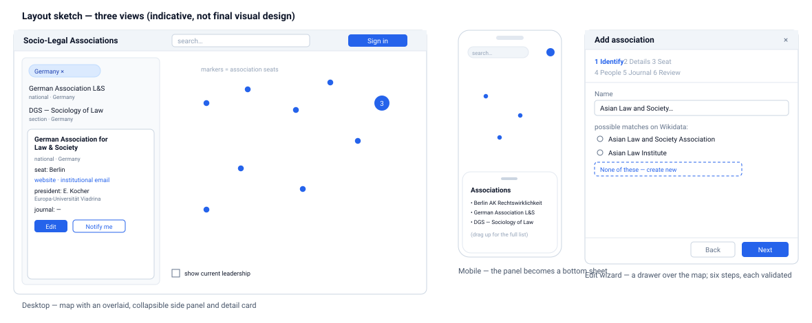
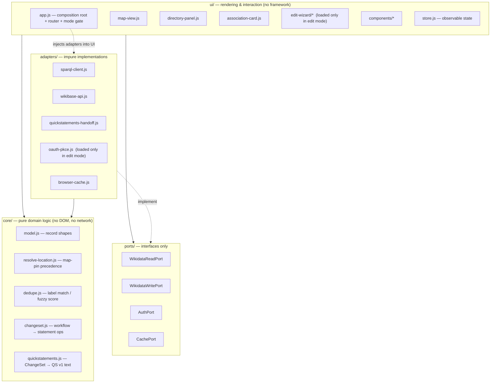

# Web UI — Design Specification

**Status:** Draft for discussion

**Date:** 2026‑09‑02

**Scope:** the browser application only. The data model, Wikidata read/write paths,
OAuth flow, and maintenance model live in the companion document
[`2026-09-01-socio-legal-associations-directory-design.md`](2026-09-01-socio-legal-associations-directory-design.md)
("the data spec") and are not repeated here.

**How to read this:** Part 1 describes what the application looks like and how it
behaves, for a non‑technical reader. Part 2 is the technical specification.

---

## Part 1 — What it looks like and how it behaves

### 1.1 Two modes: read‑only by default, editing is opt‑in

The application opens in a **strictly read‑only mode**. There is **no "sign in"
button, no "edit" button, no prompt of any kind inviting people to change the data.**
A visitor who does not know editing exists will never see a trace of it.

Editing is a **separate mode that has to be deliberately entered** (§1.6). Only then do
edit controls appear, and only then does the application ask the person to connect a
Wikimedia account. For someone who has edited before on the same device, even that
step is silent (§1.6).

Everything in §§1.2–1.5 and §§1.9–1.11 describes the read‑only mode — i.e. what every
visitor sees. §§1.6–1.8 describe the edit mode.

### 1.2 Layout at a glance



The application is **a single screen**: a world map with a panel over it. There are no
other pages, no accounts to manage, no dashboards.

### 1.3 The map

- Fills the whole window. It is the main way to browse.
- Each **marker is an association's seat** — its office or home country, *not* wherever
  its current president happens to work (see data spec §1.3). Markers **cluster** into
  a single numbered blob when you zoom out and separate as you zoom in.
- **Click a country** and it highlights; the side panel narrows to that country's
  associations.
- **Click a marker** and the panel shows that association's card.
- A **"show current leadership"** switch (bottom‑left) adds a second, lighter set of
  markers at the presidents' universities, each joined to its association's seat by a
  thin line — so the cases where the office and the president are on different
  continents are visible instead of misleading. Off by default.
- Associations that have neither a fixed seat nor a country (a few roaming
  international bodies) are not dropped somewhere arbitrary; they appear in a short
  **"no fixed location"** list in the panel.
- The map background (streets, coastlines) is just a backdrop and carries no project
  data.

### 1.4 The side panel

- Sits over the left edge of the map and can be **collapsed** to give the map the full
  window.
- It is the **complete text alternative to the map**: anything you can reach by
  clicking the map, you can also reach by reading and clicking the panel. This is what
  makes the application usable with a keyboard and a screen reader.
- At the top is a **search box**. Typing filters the list immediately and also offers
  "jump to this country" and "jump to this association".
- Each **list row** shows the association's name and, in small text, its scope and
  country (e.g. "national · Germany", "section · Germany", "regional · Asia").
- Selecting a row opens that association's **card** and moves the map to its marker.

### 1.5 The association card

Shows, for one association:

- **Name** and, in small text, **scope · country** (national / regional / topical /
  international).
- **"part of …"** when the body is a section or committee of a larger association.
- **Seat** (e.g. "seat: Berlin").
- **Website** and **institutional e‑mail** — an office or role address only, never a
  named person's private address (data spec §1.6).
- **Current president**, with the **university** they are based at underneath.
- **Journal**, when the association publishes its own (name + link); otherwise "—".
- **"Notify me of changes"** — a small link that helps a reader receive an e‑mail
  whenever this entry changes on Wikidata (data spec §1.6.1), or subscribe by feed if
  they have no Wikimedia account. This is a *reading* aid, not an edit control, so it
  is present in the default mode.
- **No "Edit" button in the default mode.** In edit mode (§1.6) an **Edit** button
  appears on the card.

### 1.6 Entering edit mode

Edit mode is never advertised in the read‑only screen. It is entered in one of two
ways, decided when the site is set up (data spec / config):

- **Preferred — the visitor is already a Wikimedia editor.** If the person previously
  connected their Wikimedia account in this browser, the application still holds a
  (revocable, edit‑only) permission for them. On their next visit it quietly renews
  that permission and shows the edit controls — **no button to press, no login form,
  no round trip.** Someone who has never edited sees nothing and is asked for nothing.
- **Alternative — an `?edit` link.** Adding `?edit` to the site's address switches the
  application into edit mode. Edit controls appear, and the person is asked once to
  **connect a Wikimedia account** (a redirect to Wikimedia's own login page and back;
  the password is never seen or stored by this site). After that first time, the
  preferred path above takes over and the connection is silent on later visits.

In both cases:

- The permission is **narrow** (it can only edit, nothing else) and can be withdrawn
  by the editor at any time from their Wikimedia settings.
- Closing the tab or choosing "leave edit mode" discards it for that session.
- Nothing about the read‑only experience changes for anyone else.

Why not simply detect that the visitor is logged in to Wikidata in another tab? A
website hosted on its own address cannot see another site's login for security
reasons; the connect‑once step above is the closest safe equivalent, and for a
returning editor it is invisible (Part 2 §2.3).

### 1.7 The edit wizard

Reached only from edit mode, by pressing **Edit** on a card or an **Add association**
control. It opens as a **drawer that slides over the map**, so you keep your place. It
has **six steps**, shown in a header:

1. **Identify** — type the association's name. As you type, the wizard shows matching
   records already on Wikidata. A **"None of these — create new"** button appears, and
   the "create" form is shown **only after you click it**. This is the main safeguard
   against creating duplicates.
2. **Details** — scope, country, website, institutional e‑mail, founding year, and at
   least one reference (a web page that backs up the facts). If the e‑mail looks
   personal (a private Gmail‑style address, or one that reads like a person's name),
   the wizard asks you to confirm it is really a shared office address before it will
   accept it.
3. **Seat** — either "fixed seat / secretariat" (you pick the place or host
   institution, and that becomes the map marker) or "no fixed seat / moves with the
   chair" (the marker then comes from the country).
4. **People** — the current president. Same search‑first behaviour as step 1. If the
   person is not already on Wikidata, a short form creates them: name, "is a
   researcher", their academic homepage, ORCID if known, and their university (picked
   from a list — universities are never created here).
5. **Journal** — only if the association publishes its own journal. You search for it
   (most already exist) and link it; a create form appears only if it is genuinely
   missing. Journals a commercial publisher runs on the association's behalf are left
   for a later phase.
6. **Review** — a plain‑language summary of every change about to be made (data spec
   §1.5), then a single **confirm**.

Each step checks its entries before **Next** will proceed. After you confirm:

- a short **progress** indicator, then
- a **success panel** with direct links to the changed Wikidata pages; or
- if something fails, the **draft is kept** and you are offered "retry" or "open in
  QuickStatements" (a Wikimedia community tool that finishes the write).

If the tab reloads mid‑edit, the draft is restored.

### 1.8 What the wizard is used for

- **Add a new association** — with its contact person and, where relevant, its
  journal.
- **Record a new president** after an election — the wizard adds the new president and
  marks the previous one's term as ended, so the history is preserved.
- **Fix a detail** — a changed e‑mail address or website: open the association, edit
  the one field, confirm.

These correspond to workflows A, B and C in the data spec §1.5.

### 1.9 What the screen shows in each situation

| Situation | What the user sees |
| --- | --- |
| Data still loading | a lightweight placeholder in the panel, a spinner on the map |
| Loaded and working normally (read‑only) | map with markers, panel with the full list, **no edit or sign‑in controls** |
| Wikidata briefly unreachable | the map still works from a saved copy, with a banner: "showing a saved copy from &lt;date&gt;" |
| A country with no association on record | "No association recorded for &lt;country&gt;" (in edit mode this becomes an "add one" prompt) |
| Edit mode, editor recognised | an "Edit mode" badge; **Edit** and **Add** controls active; no login step |
| Edit mode, first time on this device | an "Edit mode" badge; a single "Connect a Wikimedia account" action |
| Edit permission expired | a quiet "reconnect" prompt; any in‑progress draft is kept |
| A change succeeds | success panel with links to the updated Wikidata pages |
| A change fails | the draft is kept, with "retry" and "open in QuickStatements" |

### 1.10 On a phone

The map fills the screen and the panel becomes a **bottom sheet** you can drag up:
a peek showing the nearest few associations, a half‑height list, or the full list.
Search is a button that expands. Content and behaviour are otherwise the same, and the
default is equally read‑only.

### 1.11 Visual style

Deliberately plain at this stage — the sketch fixes only the **layout and behaviour**,
not the final look. The first version uses a neutral map palette, one accent colour
for markers and links, a standard system typeface, and comfortable spacing. It follows
the device's **light or dark** setting. All colour and spacing choices live in **one
small file**, so a designer can refine the appearance later without touching any of
the behaviour described above.

---

## Part 2 — Technical specification

### 2.1 No build step — rationale

Ship **hand‑written static files** (HTML, CSS, and JavaScript as native ES modules),
served exactly as written. No bundler, no transpiler, no template compiler.

For a one‑screen application with ~40 data rows and infrequent updates, maintained
mostly by non‑developers, a build step adds a Node toolchain between "edit a file" and
"see the change" — a toolchain that tends to rot when idle and that a future
maintainer would have to reconstruct before changing so much as a label. Native ES
modules run in every current browser and remove that dependency. TypeScript, JSX and
hot reload are conveniences this codebase does not need.

An **optional `dev/` toolbox** (formatter, linter, a unit‑test runner for the pure
logic) may be used by a developer but is never on the path from edit to deploy. The
decision is **reversible**: the module boundaries in §2.2 let a bundler be added later
by pointing it at `src/app.js`.

### 2.2 Architecture

Concentric layers with a strict **dependency rule: inner layers never import outer
ones.** The pure domain logic at the centre knows nothing about the DOM, the network,
the map library, or Wikidata's JSON shapes.



**`core/` — pure domain logic.** No imports except other `core/` modules; every
function deterministic and unit‑testable in isolation.

| Module | Responsibility |
| --- | --- |
| `model.js` | Record shapes as JSDoc typedefs: `Association`, `Contact`, `Journal`, `MapPin`, `DirectoryDraft`, `ChangeSet`. |
| `resolve-location.js` | The map‑pin precedence from the data spec §2.4: seat (`P159 → P625`) → country centroid → "no fixed location". One pure function. Isolated because it is the rule most likely to be tweaked. |
| `dedupe.js` | Label normalisation (case / diacritics / whitespace folding) + a fuzzy‑match score, for the search‑first duplicate guard. |
| `changeset.js` | Turns a completed `DirectoryDraft` into a declarative list of statement operations. Knows the data model, not *how* the write happens. |
| `quickstatements.js` | Serialises a `ChangeSet` to QuickStatements v1 text for the fallback write path. |

**`ports/` — interfaces.** Plain typedefs describing what the UI needs from outside;
the UI is written against these, never a concrete adapter.

| Port | Methods (sketch) |
| --- | --- |
| `WikidataReadPort` | `queryDirectory()`, `searchEntities(text, type)`, `getEntity(qid)`, `lookupByExternalId(prop, value)` |
| `WikidataWritePort` | `applyChangeSet(changeSet, token)` |
| `AuthPort` | `hasSession()`, `restore()`, `connect()`, `getToken()`, `disconnect()` |
| `CachePort` | `read(key)`, `write(key, value)` with TTL semantics |

**`adapters/` — the only impure code.**

| Adapter | Implements | Notes |
| --- | --- | --- |
| `sparql-client.js` | `WikidataReadPort.queryDirectory` | Builds the SPARQL string, `GET` to WDQS, maps bindings → `core` records. **The only file containing SPARQL.** |
| `wikibase-api.js` | rest of `WikidataReadPort`, and `WikidataWritePort` (direct) | `wbsearchentities`, `wbgetentities`, REST `POST`/`PATCH` with `Authorization: Bearer`. **The only file containing the write API.** |
| `quickstatements-handoff.js` | `WikidataWritePort` (fallback) | Opens QuickStatements with the serialised batch. Chosen at the composition root when the CORS spike (data spec §2.7) says direct writes are blocked. |
| `oauth-pkce.js` | `AuthPort` | PKCE flow with Meta‑Wiki; token handling per §2.3. Loaded only in edit mode. |
| `browser-cache.js` | `CachePort` | `localStorage` with timestamp + TTL; falls back to the bundled `data/snapshot.json` when the network fails. |

**`ui/` — rendering and interaction.** Depends on `core/` and `ports/`. No framework.

- **`app.js`** — composition root: reads the **mode** (§2.3), constructs the read
  adapters always and the write/auth adapters only in edit mode, injects them, starts
  the router. Hash routes: `#/`, `#/country/<ISO>`, `#/assoc/<QID>`; plus
  `#/add`, `#/edit/<QID>` which are **inert unless edit mode is active**. Deep‑linkable
  with no routing library.
- **`store.js`** — one small observable holding
  `{ status, mode, directory, filter, selection, route, auth }`. Views subscribe and
  re‑render their own region. Unidirectional. ~40 lines.
- **`map-view.js`** — owns the map‑library instance. Input: `MapPin[]` + a layer flag.
  Output: `select(id)` events. Knows nothing about Wikidata; swapping map libraries
  touches only this file.
- **`directory-panel.js`** — the side list: search results, country filter, "no fixed
  location" list.
- **`association-card.js`** — read‑only detail render; the **Edit** button is rendered
  only when `store.mode === "edit"`.
- **`edit-wizard/`** — dynamically `import()`ed the first time edit mode needs it.
  `wizard.js` holds the `DirectoryDraft` and step order; `step-*.js` each render +
  validate one step. On finish the wizard asks `core/changeset.js` for the `ChangeSet`
  and hands it to `WikidataWritePort`.
- **`components/`** — `entity-typeahead.js` (search‑first dedupe widget, reused for
  association / person / university / journal), `field.js`, `toast.js`.
- **`render.js`** — ~30‑line helper: `<template>` clone‑and‑fill plus an `html`
  escaping tag. No virtual DOM; per‑region re‑render is ample at this size.

**Why this shape.** Each likely change is contained: the map library in one file, the
location rule in one pure function, direct‑write vs QuickStatements a one‑line choice
at the composition root, visual tokens in one CSS file (§2.4), the entire edit/auth
surface behind a mode gate that is off by default. `core/` modules import identically
in a browser test page and under `node --test`.

### 2.3 Edit mode and authentication

**The default is read‑only and inert.** With no edit trigger present, `app.js` never
imports `oauth-pkce.js` or `edit-wizard/*`, never touches auth storage, and renders no
edit or sign‑in affordance. The read path (SPARQL + cache + snapshot) is all that
runs.

**Two triggers put the app into edit mode**, selected by `config.json`
(`editTrigger: "session" | "param" | "either"`):

| Trigger | Behaviour |
| --- | --- |
| **`session`** (preferred) | On load, `app.js` calls `AuthPort.hasSession()`. If a stored refresh token exists, `AuthPort.restore()` silently exchanges it for a fresh access token; on success the app enters edit mode with **no user interaction**. If there is no stored token, the app stays read‑only and shows nothing. This makes edit capability **self‑enforcing**: only people who have previously connected an account ever see edit controls. |
| **`param`** | Edit mode is entered when the URL contains `?edit` (configurable name). Edit controls render immediately; the first write action (or an explicit "Connect" control) runs `AuthPort.connect()` — the OAuth 2.0 PKCE redirect to Meta‑Wiki and back via `callback.html`. |
| **`either`** | `session` if a token is present, otherwise `param`. |

**OAuth 2.0, public client, PKCE** — exactly as the data spec §2.5: a non‑confidential
consumer, no client secret, `authorize` → `callback.html` → `access_token`. Grants are
edit‑only.

**Token storage** (`config.json` `tokenPersistence`):

- `"persistent"` (default for the `session` trigger): refresh token in `localStorage`,
  access token in memory. A returning editor is recognised across visits with no
  round trip. Trade‑off: a refresh token in `localStorage` is exposed to any script
  running on the origin, so it depends on the site having **no third‑party scripts**
  and **SRI‑pinned vendored libraries** (§2.5) — which is already the case. The token
  is narrow (edit‑only) and revocable by the editor at Meta‑Wiki
  `Special:OAuthManageMyGrants`.
- `"session"`: refresh + access token in `sessionStorage` only. No cross‑visit
  recognition; entering edit mode always needs the `?edit` param and a (usually
  one‑click, already‑authorised) redirect. Choose this if the `localStorage`
  trade‑off is unwanted.

**"Leave edit mode"** clears the in‑memory access token and, for `"session"`, the
`sessionStorage` entries; for `"persistent"` it also offers "forget this device"
which removes the refresh token and calls the OAuth revoke endpoint.

**Rejected: detecting an existing wikidata.org login without OAuth.** A static site on
its own origin cannot read Wikimedia session cookies, and Wikimedia does not send
`Access-Control-Allow-Credentials` to third‑party origins, so a silent
`meta=userinfo` probe is not possible. `Special:CentralAutoLogin` image/iframe beacons
are undocumented for third parties and increasingly blocked by browser
anti‑tracking — not a foundation to build on. The `session` trigger with a persisted
refresh token is the supported way to get the same "no separate login" outcome for
returning editors.

**Draft safety.** The wizard writes its `DirectoryDraft` to `localStorage` on every
step. A reload — including the redirect for a first‑time `connect()` — restores the
draft.

### 2.4 File layout (served exactly as written)

```text
/index.html            # shell: map container + panel + <script type="module" src="/src/app.js">
/callback.html          # OAuth redirect target (edit mode only): reads ?code, stores token, redirects to /#/
/config.json            # runtime config (see §2.5)
/data/
   snapshot.json        # offline fallback dataset — committed, refreshed by CI (data spec §2.9)
   countries.geojson    # simplified world polygons: country click + centroids, one source of truth
/styles/
   tokens.css           # design tokens: colour, spacing, type scale  ← the one file a designer edits
   app.css              # layout + component styles (consumes only tokens)
/src/
   app.js  store.js  render.js
   core/      model.js  resolve-location.js  dedupe.js  changeset.js  quickstatements.js
   ports/     index.js
   adapters/  sparql-client.js  wikibase-api.js  quickstatements-handoff.js  oauth-pkce.js  browser-cache.js
   ui/        map-view.js  directory-panel.js  association-card.js
              components/  entity-typeahead.js  field.js  toast.js
              edit-wizard/ wizard.js  step-identify.js  step-details.js  step-seat.js  step-people.js  step-journal.js  step-review.js
/vendor/
   leaflet.js  leaflet.css            # pinned exact version, Subresource-Integrity hash in index.html
/dev/                                  # OPTIONAL, never required to build or deploy
   package.json (formatter, linter, test runner)  tests/  serve.md
/README.md                             # run locally, make common changes, deploy
```

Everything is referenced by **relative path**, so the site works at a domain root or
in a subfolder. Running locally = serve the folder with any static file server; one
command, documented in the README, no install.

### 2.5 Configuration, not code

`config.json` is fetched at startup and holds everything a non‑developer might change:

- OAuth **client ID** (public) and redirect URI
- **`editTrigger`** (`"session" | "param" | "either"`), **`editParam`** name (default
  `edit`), **`tokenPersistence`** (`"persistent" | "session"`)
- in‑scope **class / field QIDs** (data spec §2.3) and label languages
- basemap tile URL (and key, if the provider needs one)
- project notification inbox (data spec §2.9)
- feature flags: `writeMode: "direct" | "quickstatements"`, `leadershipLayerDefault`,
  cache TTL

### 2.6 Libraries and external resources

- **Map: Leaflet** for the first cut — small, dependency‑free, works with plain raster
  tiles and no API key from a suitable provider. Country polygons and centroids come
  from the bundled `countries.geojson` (Natural Earth 1:110 m, simplified).
  **MapLibre GL** is the documented alternative for crisp vector zoom; because
  `map-view.js` is isolated, switching is a contained change.
- **No other runtime dependencies.** No framework, no jQuery, no utility library.
- Libraries are **vendored** as pinned files in `/vendor/` with a Subresource‑Integrity
  hash in `index.html` (or loaded from an allowed CDN with the same pin + hash). This
  no‑third‑party‑script property is also what makes the `"persistent"` token option
  (§2.3) acceptable.

### 2.7 How updates are made, and by whom

| Change | Steps | Who |
| --- | --- | --- |
| Wording, colour, spacing, add a field to the card | edit a `.css` / `.js` / `.html` file → refresh → commit → push or ZIP | any web developer; a careful non‑developer for text/colour |
| In‑scope QIDs, languages, tile source, edit trigger, feature flags | edit `config.json` | project lead with instructions |
| Bump the map library | replace `/vendor/*`, update the SRI hash, smoke‑test | web developer, ~yearly |
| New behaviour (e.g. a new wizard step) | edit `src/…`, still no build | web developer |
| Deploy | copy files to the web root over HTTPS; `callback.html` path must match the registered OAuth redirect URI | web developer or site maintainer |

CI (optional) refreshes `data/snapshot.json` and may run the `core/` tests. **CI does
not build the site.**

### 2.8 Testing without a build

- **`core/` modules:** assertion tests runnable two ways — a `dev/tests/` suite under
  `node --test`, and a `tests.html` page that imports the same modules in a browser.
  Neither is required to deploy.
- **Adapters:** thin by design; covered by a short manual checklist against a Wikidata
  test item plus the CORS spike (data spec §2.7).
- **UI flows:** a manual QA checklist — read‑only load with **no edit affordance
  visible**; offline banner; country select; card; then, per edit trigger: silent
  `session` restore, `?edit` connect, each wizard path, success and failure, "leave
  edit mode".

### 2.9 Risks and open questions

| Item | Note / action |
| --- | --- |
| **`localStorage` refresh token** exposure model | Acceptable only while the site ships no third‑party scripts and SRI‑pins vendored libs. If that ever changes, switch `tokenPersistence` to `"session"`. |
| **Basemap tile source** — keyless vs keyed, attribution, usage limits | Pick during build; URL/key live in `config.json`. Fallback: a light bundled vector style. |
| **Country‑polygon size** vs. map crispness | Natural Earth 1:110 m simplified is ~100–200 KB gzipped; acceptable. Revisit only if a finer boundary is needed. |
| **No‑framework re‑render** ergonomics as the wizard grows | If it becomes unwieldy, a ~3 KB template library (still no build, loaded as a module) before any bundler. |
| Same **CORS / write‑path** open question as data spec §2.7 | Already abstracted behind `WikidataWritePort`; no extra UI risk. |

### 2.10 Out of scope (UI)

- Any build pipeline, bundler, or transpiler on the deploy path.
- A component framework or state‑management library.
- Server‑side rendering, pre‑rendering, or a CMS.
- Screens or routes beyond those in §2.2.
- Any edit or sign‑in affordance in the default (read‑only) mode.
- Detecting Wikimedia login state without OAuth (§2.3).
- Offline editing; PWA install; push notifications.
- End‑user theming beyond the device's light/dark setting.
- Analytics, tracking, cookie banners.
