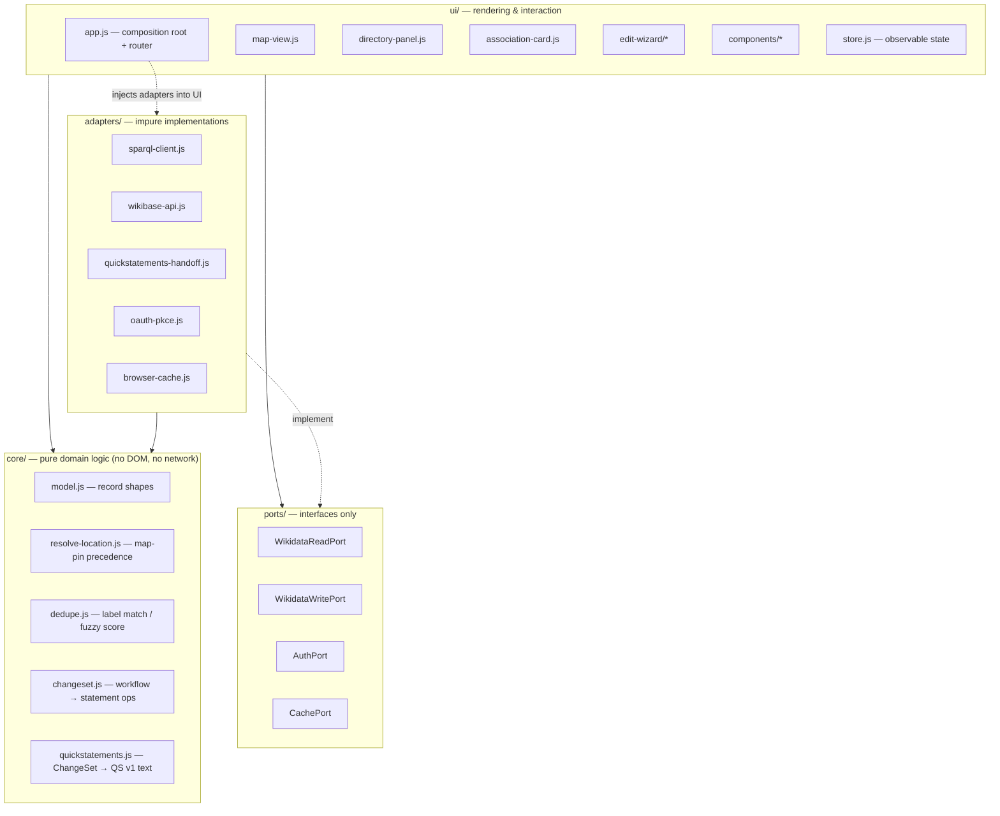

# Web UI — Design Specification

**Status:** Draft for discussion

**Date:** 2026‑09‑02

**Scope:** the browser application only — how it is structured, how it is built (or
not), and a first visual sketch. The data model, Wikidata read/write paths, OAuth
flow, and maintenance model are defined in the companion document
[`2026-09-01-socio-legal-associations-directory-design.md`](2026-09-01-socio-legal-associations-directory-design.md)
("the data spec") and are not repeated here.

**Audience:** the first two sections are readable without a programming background; the
rest is precise technical detail for whoever builds it.

---

## 1. What the UI has to do

One screen, three jobs:

1. **Show** a zoomable world map of association seats, with a searchable/filterable
   side panel and a detail card per association.
2. **Explain** each association: scope, seat, website, institutional e‑mail, current
   president (and their university), and the association's own journal where it has
   one.
3. **Edit** — behind "Sign in with Wikimedia" — through a short guided wizard that
   adds or corrects an association, its contact person, and (phase 3) its journal,
   writing straight to Wikidata.

It is a **single page**. There are no other views, no user profiles, no dashboards
(see the data spec §2.8). This smallness is the main input to every decision below.

---

## 2. Build step or no build step?

The question: can we **write the static HTML/CSS/JS by hand and ship it as‑is**, or do
we need a **build step** (templates + a bundler, possibly TypeScript) that turns source
files into the deployable site?

A build step buys TypeScript, JSX/template compilation, hot reload, minification, and
npm‑managed dependencies. It costs a standing tool dependency: **before anyone can
change the UI — even a label or a colour — they must install Node, the exact
toolchain, run `npm install`, and run the build.** If that toolchain is left idle for
a year or two it usually rots (lockfile drift, dropped transitive packages, native
build failures), and a future maintainer inherits a site they cannot rebuild.

| | **No build (recommended)** | **Build step (templates / bundler)** |
| --- | --- | --- |
| Edit → see the change | save file, refresh browser | run the build first |
| Who can update UI text/layout | any web developer, or a careful non‑developer | only someone with the toolchain installed and working |
| Prerequisites to make a change | a text editor | Node + npm + `npm install` + an intact toolchain |
| Deploy | upload the files / `git push` | build, then upload `dist/` (or trust a CI pipeline) |
| "Send a ZIP to the site maintainer" still works | yes | no — the ZIP would be pre‑built output nobody can edit |
| Rot risk after 1–3 years idle | ~none (browsers run ES modules natively) | high |
| TypeScript, JSX, hot reload, minify | no | yes |
| Payload | a handful of unminified files + one map library | one minified bundle |
| Fit to this project (one view, ~40 rows, rare updates, non‑developer maintainers) | strong | over‑engineered |

**Recommendation: no build step.** For a one‑screen app with ~40 data rows and
infrequent updates, hand‑written modern JavaScript (ES modules, native in every
current browser) is sufficient and keeps the "edit a file, refresh, commit" loop open
to non‑specialists. TypeScript and JSX are conveniences this size of codebase does not
need.

Keep an **optional developer toolbox** in a `dev/` folder (code formatter, linter,
a unit‑test runner for the pure logic) that a developer *may* use but that is **never
on the path from edit to deploy**. If it rots, the site is unaffected because there is
nothing to build.

**This choice is reversible.** Because the app code is plain ES modules with clean
boundaries (§3), adding a bundler later is mechanical — point it at `src/app.js` —
should the UI ever grow enough to justify one.

---

## 3. Architecture (clean, layered)

The code is organised in concentric layers with a strict **dependency rule: inner
layers never import outer ones.** The pure domain logic at the centre knows nothing
about the DOM, the network, MapLibre, or Wikidata's JSON shapes.



### 3.1 `core/` — pure domain logic

No imports except other `core/` modules. Every function is deterministic and
unit‑testable in isolation.

| Module | Responsibility |
| --- | --- |
| `model.js` | The record shapes as JSDoc typedefs: `Association`, `Contact`, `Journal`, `MapPin`, `DirectoryDraft`, `ChangeSet`. No classes needed. |
| `resolve-location.js` | The **map‑pin precedence** from the data spec §2.4: seat (`P159 → P625`) → country centroid → "no fixed location". One pure function `resolvePin(association, centroidTable)`. This rule is the most likely thing to be tweaked, so it lives alone. |
| `dedupe.js` | Label normalisation (case / diacritics / whitespace folding) and a fuzzy‑match score, used by the search‑first duplicate guard. |
| `changeset.js` | Turns a completed wizard `DirectoryDraft` into a **declarative list of statement operations** (add `P488`, create item with these claims, end‑date the previous `P488`, …). Knows the data model; knows nothing about *how* the write happens. |
| `quickstatements.js` | Serialises a `ChangeSet` to QuickStatements v1 text for the fallback write path. |

### 3.2 `ports/` — interfaces

Plain typedefs describing what the UI needs from the outside world. Each has one or
more adapters; the UI is written against the interface, never a concrete adapter.

| Port | Methods (sketch) |
| --- | --- |
| `WikidataReadPort` | `queryDirectory()`, `searchEntities(text, type)`, `getEntity(qid)`, `lookupByExternalId(prop, value)` |
| `WikidataWritePort` | `applyChangeSet(changeSet, token)` |
| `AuthPort` | `signIn()`, `getToken()`, `signOut()`, `isSignedIn()` |
| `CachePort` | `read(key)`, `write(key, value)`, with TTL semantics |

### 3.3 `adapters/` — the only impure code

| Adapter | Implements | Notes |
| --- | --- | --- |
| `sparql-client.js` | `WikidataReadPort.queryDirectory` | Builds the SPARQL string, `GET` to WDQS, maps result bindings → `core` records. **The only file that contains SPARQL.** |
| `wikibase-api.js` | rest of `WikidataReadPort`, and `WikidataWritePort` (direct) | `wbsearchentities`, `wbgetentities`, REST `POST`/`PATCH` with `Authorization: Bearer`. **The only file that contains the write API.** |
| `quickstatements-handoff.js` | `WikidataWritePort` (fallback) | Opens QuickStatements with the serialised batch. Chosen at the composition root when the CORS spike (data spec §2.7) says direct writes are blocked. |
| `oauth-pkce.js` | `AuthPort` | The PKCE dance with Meta‑Wiki; token in `sessionStorage`; cleared on sign‑out / tab close. |
| `browser-cache.js` | `CachePort` | `localStorage` with timestamp + TTL; falls back to the bundled `data/snapshot.json` when the network fails. |

### 3.4 `ui/` — rendering and interaction

Depends on `core/` and `ports/`. No framework.

- **`app.js`** — composition root: constructs the adapters, injects them, starts the
  router. Hash‑based routes: `#/`, `#/country/<ISO>`, `#/assoc/<QID>`, `#/add`,
  `#/edit/<QID>`. Deep‑linkable and back‑button‑friendly with zero routing library.
- **`store.js`** — one small observable holding
  `{ status, directory, filter, selection, route, auth }`. Views subscribe and
  re‑render their own region. Unidirectional: view → intent → store update → re‑render.
  ~40 lines, no Redux.
- **`map-view.js`** — owns the map library instance. Input: an array of `MapPin`
  view‑models + a layer flag. Output: `select(id)` events. Knows nothing about
  Wikidata. Swapping map libraries touches only this file.
- **`directory-panel.js`** — the side list: search results, country filter, "no fixed
  location" list.
- **`association-card.js`** — read‑only detail render.
- **`edit-wizard/`** — `wizard.js` holds the `DirectoryDraft` and step order;
  `step-identify.js`, `step-details.js`, `step-seat.js`, `step-people.js`,
  `step-journal.js`, `step-review.js` each render + validate one step. On finish the
  wizard asks `core/changeset.js` for the `ChangeSet` and hands it to
  `WikidataWritePort`.
- **`components/`** — `entity-typeahead.js` (the search‑first dedupe widget, reused for
  association / person / university / journal), `field.js`, `toast.js`.
- **`render.js`** — ~30‑line helper: `<template>` clone‑and‑fill, plus an `html`
  string‑escaping tag. No virtual DOM; at ~40 rows, per‑region re‑render is ample.

### 3.5 Why this shape

- **Refinable.** Each likely change is contained: the map library lives in one file;
  the location rule in one pure function; direct‑write vs QuickStatements is a
  one‑line choice at the composition root; visual tokens in one CSS file (§5).
- **Testable without a build.** `core/` modules are plain ESM — they import the same
  way in a browser test page and in `node --test` for developers who have Node.
- **Legible.** A newcomer can read `core/` in ten minutes and know the domain rules
  without wading through rendering or fetch code.

---

## 4. File layout (served exactly as written)

```
/index.html            # shell: map container + panel + <script type="module" src="/src/app.js">
/callback.html          # OAuth redirect target: reads ?code, stores token, redirects to /#/
/config.json            # runtime config (see §6)
/data/
   snapshot.json        # offline fallback dataset — committed, refreshed by CI (data spec §2.9)
   countries.geojson    # simplified world polygons: country click + centroids, one source of truth
/styles/
   tokens.css           # design tokens: colour, spacing, type scale  ← the "design system"
   app.css              # layout + component styles
/src/
   app.js  store.js  render.js
   core/      model.js  resolve-location.js  dedupe.js  changeset.js  quickstatements.js
   ports/     index.js
   adapters/  sparql-client.js  wikibase-api.js  quickstatements-handoff.js  oauth-pkce.js  browser-cache.js
   ui/        map-view.js  directory-panel.js  association-card.js
              components/  entity-typeahead.js  field.js  toast.js
              edit-wizard/ wizard.js  step-identify.js  step-details.js  step-seat.js  step-people.js  step-journal.js  step-review.js
/vendor/
   leaflet.js  leaflet.css            # pinned exact version, Subresource‑Integrity hash in index.html
/dev/                                  # OPTIONAL, never required to build or deploy
   package.json  (formatter, linter, test runner)  tests/  serve.md
/README.md                             # how to run locally, how to make common changes, how to deploy
```

Everything is referenced by **relative path**, so the site works at a domain root or
in a subfolder. Running locally = serve the folder with any static file server (needed
only because ES modules and `fetch` do not work from `file://`); a one‑line command,
documented in the README, no install.

---

## 5. Visual sketch (basic — to be refined)

Design detail is explicitly out of scope for now; this fixes only layout, regions, and
states so the build can start.

### 5.1 Desktop

```
┌──────────────────────────────────────────────────────────────────────┐
│  Socio‑Legal Associations              [ search…            ]  [Sign in]│
│ ┌────────────────────────────┐                                        │
│ │ PANEL                       │               M A P                    │
│ │  filter: Germany  ✕         │        (markers = association seats)  │
│ │ ───────────────────────────│              ◉        ◉               │
│ │  • German Association L&S   │         ◉         ◉         ◉        │
│ │  • DGS — Sociology of Law   │                ◉                     │
│ │ ┌────────────────────────┐ │                                       │
│ │ │ CARD                    │ │                                       │
│ │ │ German Association L&S   │ │                                       │
│ │ │ national · Germany       │ │                                       │
│ │ │ seat: Berlin             │ │                                       │
│ │ │ website · email          │ │                                       │
│ │ │ president: E. Kocher      │ │                                       │
│ │ │   (Europa‑Univ. Viadrina)│ │                                       │
│ │ │ journal: —               │ │                                       │
│ │ │ [ Edit ]  [ Notify me ]  │ │                                       │
│ │ └────────────────────────┘ │                                       │
│ └────────────────────────────┘    [ ▢ show current leadership ]        │
└──────────────────────────────────────────────────────────────────────┘
```

- **Map** fills the viewport. Markers cluster when zoomed out. Clicking a country
  polygon selects it and filters the panel; clicking a marker selects that
  association.
- **Panel** overlays the left edge, collapsible. It is the full text alternative to
  the map (accessibility): everything reachable on the map is reachable in the list.
- **Search box** (top) filters the panel live and offers "jump to country / jump to
  association".
- **Leadership toggle** (bottom‑left) adds the secondary marker set at presidents'
  universities, each joined to its seat by a thin line (data spec §2.4).
- **Sign in / account** (top‑right); when signed in it shows the username and a
  "sign out", and every card gains an active **Edit** button.

### 5.2 Mobile

Map full‑bleed; the panel becomes a **bottom sheet** (peek → half → full). Search is a
button that expands. Same content, same routes.

### 5.3 Edit wizard (drawer over the map, context kept)

```
┌───────────────────────────────────┐
│  Add association               ✕  │
│  ① Identify ② Details ③ Seat       │
│  ④ People   ⑤ Journal  ⑥ Review    │
│ ─────────────────────────────────│
│  Name  [ Asian Law and Society… ] │
│   ▸ possible matches on Wikidata:  │
│     ○ Asian Law and Society Assoc. │
│     ○ Asian Law Institute          │
│     ( None of these — create new ) │
│ ─────────────────────────────────│
│                    [ Back ] [ Next ]│
└───────────────────────────────────┘
```

- Steps validate before **Next**. Step ⑥ shows the plain‑language summary from the
  data spec §1.5.
- Submit → progress → **success panel** with links to the changed Wikidata pages, and
  a "Notify me of changes" prompt. On failure the draft is kept, with "retry" and
  "open in QuickStatements" options.

### 5.4 States every region must handle

| Region | States |
| --- | --- |
| Map / panel | loading (skeleton), ready, **stale/offline** ("showing saved copy from &lt;date&gt;" banner), error |
| Country with no data | "No association recorded for &lt;country&gt; — add one" |
| Auth | signed‑out, signing‑in, signed‑in, token expired ("sign in again") |
| Wizard | per‑step invalid, submitting, success (diff links), failed (draft kept) |

### 5.5 Design tokens

`styles/tokens.css` is the single file a designer later edits: colour roles
(surface, text, accent, marker, marker‑leadership), an 8‑px spacing scale, a type
scale, and `prefers-color-scheme` light/dark values. `app.css` consumes only tokens.
First cut: neutral cartographic palette, one accent colour, system font stack,
generous line‑height. Deliberately plain.

---

## 6. Configuration, not code

`config.json` is fetched at startup and holds everything a non‑developer might need to
change, so these never require touching JS:

- OAuth **client ID** (public) and redirect URI
- in‑scope **class / field QIDs** (data spec §2.3) and label languages
- basemap tile URL (and key if the chosen provider needs one)
- project notification inbox (data spec §2.9)
- feature flags: `writeMode: "direct" | "quickstatements"`, `leadershipLayerDefault`,
  cache TTL

---

## 7. Libraries and external resources

- **Map: Leaflet** for the first cut — small, dependency‑free, works with plain raster
  tiles and no API key from a suitable provider; country polygons and centroids come
  from the bundled `countries.geojson` (Natural Earth 1:110 m, simplified). **MapLibre
  GL** is the documented alternative for crisp vector zoom; because `map-view.js` is
  isolated, switching is a contained change.
- **No other runtime dependencies.** No framework, no jQuery, no utility library.
- Libraries are **vendored** as pinned files in `/vendor/` with a Subresource‑Integrity
  hash in `index.html` (or loaded from an allowed CDN with the same pin + hash).
  Updating a library = replace the file, re‑hash, smoke‑test; a developer task roughly
  yearly (data spec §1.6).

---

## 8. How updates are made, and by whom

| Change | Steps | Who |
| --- | --- | --- |
| Wording, colour, spacing, add a field to the card | edit a `.css` / `.js` / `.html` file → refresh → commit → push or ZIP | any web developer; a careful non‑developer for text/colour |
| In‑scope QIDs, languages, tile source, feature flags | edit `config.json` | project lead with instructions |
| Bump the map library | replace `/vendor/*`, update the SRI hash, smoke‑test | web developer, ~yearly |
| New behaviour (e.g. a new wizard step) | edit `src/…`, still no build | web developer |
| Deploy | copy files to the web root over HTTPS; `callback.html` path must match the registered OAuth redirect URI | web developer or site maintainer |

CI (optional) refreshes `data/snapshot.json` and may run the `core/` tests. **CI does
not build the site** — there is nothing to build.

---

## 9. Testing without a build

- **`core/` modules:** assertion tests runnable two ways — a `dev/tests/` suite under
  `node --test` for developers, and a `tests.html` page that imports the same modules
  and runs them in a browser. Neither is required to deploy.
- **Adapters:** thin by design; covered by a short manual checklist against a Wikidata
  test item plus the CORS spike (data spec §2.7).
- **UI flows:** a manual QA checklist (load, offline banner, country select, card,
  sign‑in, each wizard path, success and failure).

---

## 10. Risks and open questions

| Item | Note / action |
| --- | --- |
| **Basemap tile source** — keyless vs keyed, attribution, usage limits | Pick during build; the URL/key live in `config.json`. Fallback: a very light bundled vector style. |
| **Country‑polygon size** vs. map crispness | Natural Earth 1:110 m simplified is ~100–200 KB gzipped; acceptable. Revisit only if a finer boundary is needed. |
| **No‑framework re‑render** ergonomics as the wizard grows | The wizard is the most complex part; if it becomes unwieldy, a ~3 KB template library (still no build, loaded as a module) is the first step before any bundler. |
| **`sessionStorage` token loss on reload mid‑edit** | Wizard keeps the draft in `localStorage`; after re‑auth the draft is restored. |
| Same **CORS / write‑path** open question as the data spec §2.7 | The UI already abstracts it behind `WikidataWritePort`; no extra UI risk. |

---

## 11. Out of scope (UI)

- Any build pipeline, bundler, or transpiler on the deploy path.
- A component framework or state‑management library.
- Server‑side rendering, pre‑rendering, or a CMS.
- Multiple screens / routes beyond those in §3.4.
- Offline editing; PWA install; push notifications.
- Theming UI for end users beyond `prefers-color-scheme`.
- Analytics, tracking, cookie banners (nothing to consent to).
